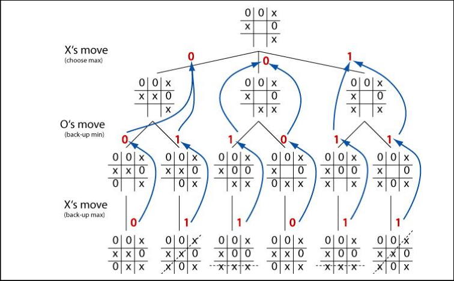

# AI-TicTacToe

Tic Tac Toe is a simple two-player game played on a 3×3 grid, where one player marks "X" and the other "O". Players take turns marking empty cells with their symbol, aiming to be the first to place three of their marks in a horizontal, vertical, or diagonal row. The game ends when a player wins or when all cells are filled with no winner, resulting in a draw. Due to its small board and clear rules, it is often used as a teaching tool for strategic thinking, logic, and programming.

## 🧠 Features

- Human vs AI gameplay
- Optimal AI using the minimax algorithm
- Cross-platform build support via Makefile

---

## Minimax algorithm

The **minimax algorithm** is a recursive decision-making algorithm used in two-player, turn-based games like Tic Tac Toe, Chess, and Checkers. It assumes that both players play optimally—one trying to **maximize** their own score (the "max" player), while the other tries to **minimize** it (the "min" player). At each possible game state, the algorithm explores all potential future moves, builds a game tree, and assigns scores to outcomes (win, lose, draw). Then, it backtracks through the tree to choose the move that leads to the best possible result, assuming the opponent also makes the best possible counter-move. This makes minimax ideal for building unbeatable AIs in deterministic, zero-sum games with complete information.



## Demo

Insert gif or link to demo


# Installation
## 📦 Clone the Repository

```bash
git clone https://github.com/AryanERTash/AI-TicTacToe.git
cd AI-TicTacToe
```

## ⚙️ Build Instructions

This project uses `make` for compilation. Make sure you have `g++` and `make` installed.

### 🐧 For Linux and 🍎 macOS:

```bash
make
```

This generate main.out on linux and mac and main.exe on windows.

To run the game:

```bash
make run
```

or manually:

```bash
./main.out   # For Linux and mac
```

### 🪟 For Windows (via WSL, Git Bash, or cmd with MinGW):

```bash
make
./main.exe
```

## 🧹 Clean Build Files

To remove the compiled files:

```bash
make clean
```

---

